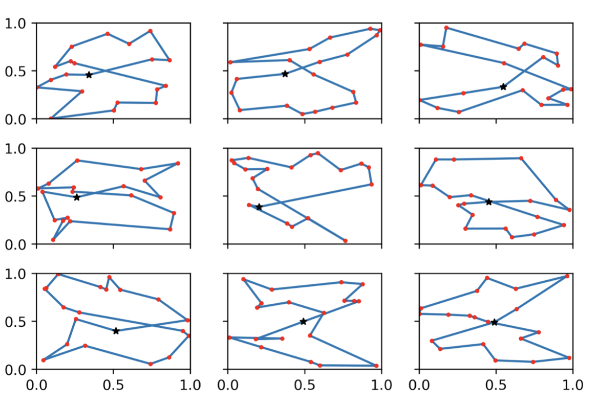

# Neural Network Approach

Implementation reference: [pytorch-drl4vrp](https://github.com/mveres01/pytorch-drl4vrp)

Implementation of: 
> Nazari, Mohammadreza, et al. "Deep Reinforcement Learning for Solving the Vehicle Routing Problem." arXiv preprint arXiv:1802.04240 (2018).

## Requirements:

* Python 3.6
* pytorch=0.4.1
* matplotlib

## To Run

Run the Goolge Colab notebook ```optim_rl_colab.ipynb```

## Results

### TSP Sample Tours:

<p align="left">
  
</p>

### TSP Learning Curve:

<p align="left">
  
</p>


# Classic Heuristic Approach

Implementation reference: [VeRyPy](https://github.com/yorak/VeRyPy)

> Rasku, J., Kärkkäinen, T., & Musliu, N. (2019). Meta-Survey and Implementations of Classical Capacitated Vehicle Routing Heuristics with Reproduced Results. In J. Rasku, Toward Automatic Customization of Vehicle Routing Systems (pp. 133-260). JYU Dissertations 113, University of Jyväskylä, Finland.

Implementation of:

* Sweep Algorithm
> GM74-SwRI: Gillett, B. E. and Miller, L. R. (1974). A heuristic algorithm for the vehicle-dispatch problem. Operations Research, 22(2):340-349. 

* Clarke & Wright
> CW64-PS:Clarke, G. and Wright, J. W. (1964). Scheduling of vehicles from a central depot to a number of delivery points. Operations Research, 12(4):568-581.

## To Run

1. Convert the simulated datasets into `.vrp` format files by running `RL_Dataset.ipynb` and download (automatically)
2. Download VeRyPy library from the link above and set up following its README
3. Run `run_heuristic.sh` with modified path and flag of prefered algorithm. Here we used `swp` for Sweep Algorithm and `ps` for Clarke & Wright
